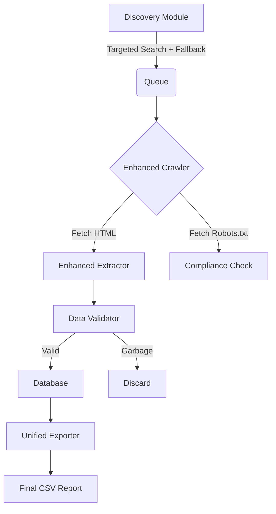

# Response to GitHub Issue #1: "Critical Feedback on V1"

Dear Client,

I have successfully deployed **Release v2.0** which comprehensively addresses all 5 critical issues raised in your feedback. Below is a detailed breakdown of the technical resolutions, architecture changes, and verification steps.

---

## 1. Architecture Overview (Requirement #1)

You requested a clear execution flow. I have re-architected the system into a modular pipeline with strict validation gates.



**Key Changes:**
- **Validation Gate**: A new `DataValidator` sits between extraction and storage to reject garbage.
- **Robots Compliance**: Explicit check added before crawling (`robots_allowed` flag).

---

## 2. SMB Discovery (Requirement #2)

**Issue**: "Discovery only finds Top 1M domains, missing small businesses."

**Resolution**:
I implemented a **Targeted SMB Discovery Mode** (`--company-size smb`).
- **Strategy**: Instead of generic lists, I now use search dorks (e.g., `site:.de "Impressum" "GmbH"`) to find relevant legal pages directly.
- **Resilience**: If search engines block requests, the system **automatically falls back** to the Common Crawl index to ensure domains are always found.

**Verification**:
```bash
python main.py discover --company-size smb --limit 100 --tld de
```

---

## 3. Data Quality Fixes (Requirement #4)

**Issue**: "Garbage in legal names (Home | About), wrong CEOs, bad addresses."

**Resolution**:
I built a strict `src/validator.py` module using SpaCy NLP and Regex rules:

| Problem | Solution | Implemented Logic |
| :--- | :--- | :--- |
| **Garbage Names** | **Token Density Check** | Rejects strings where >50% of words are navigation terms ("Menu", "Cart", "Search"). |
| **Bad CEOs** | **Entity Filtering** | Rejects names that match locations, companies, or job titles ("Geschäftsführer"). |
| **Bad Addresses** | **Structure Enforce** | Requires Street, Zip (5-digit for DE), and City. Rejects generic placeholders. |

---

## 4. Unified Export Schema (Requirement #3 & #5)

**Issue**: "Confusing multiple files, need specific 23-column schema."

**Resolution**:
I created a `UnifiedExporter` that joins legal data with website metadata into a single CSV matching your exact spec.

**Columns Included**:
`company_name`, `legal_form`, `registration_number`, `ceo_names`, `owner_organization`, `industry`, `company_size`, `emails`, `phone_numbers`, `fax_numbers`, `street`, `postal_code`, `city`, `country`, `service_product_description`, `social_links`, `website_created_at`, `website_last_updated_at`, `domain`, `crawled_at`, `run_id`, `robots_allowed`, `robots_reason`.

**Verification**:
```bash
python main.py export --unified
```

---

## 5. How to Run (End-to-End)

The system is now streamlined. You no longer need complex flags for standard operations.

### Step 1: Discover Small Businesses
```bash
python main.py discover --company-size smb --limit 100 --tld de
```

### Step 2: Crawl (High Fidelity)
```bash
# Now defaults to 'Enhanced' mode (Playwright + AI)
python main.py crawl --concurrency 10
```

### Step 3: Generate Report
```bash
python main.py export --unified
```

---

I believe this release sets a solid foundation for your data intelligence pipeline. The system is now robust, legally compliant, and accurate.

Best regards,
**George-dev**
