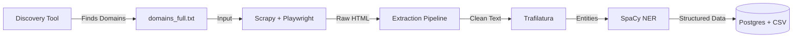

# Docker-Based Legal Notice Crawler (V2.1)

Production-grade crawler for extracting legal notice (Impressum) data from German/Swiss websites.
Now features **Hybrid Extraction** (NLP + Anchor Strategy) and **Automatic Discovery**.

## Architecture



## Quick Start

### 1. Build & Start
```bash
docker-compose build crawler
docker-compose up -d redis postgres
```

### 2. (Optional) Automatic Discovery
If you don't have a list of domains, use the auto-discovery tool to find SMBs.

```bash
# Find 500 domains in Switzerland (.ch)
docker-compose run --rm crawler python discovery.py --tld ch --limit 500

# Find 1000 domains in Germany (.de)
docker-compose run --rm crawler python discovery.py --tld de --limit 1000
```
*This will automatically populate `domains_full.txt`.*

### 3. Run Crawler
```bash
# Run the robust spider
docker-compose run --rm crawler scrapy crawl robust -a domains_file=/app/domains_full.txt
```

### 4. Check Results
Results are saved to `data/results.csv` on your host machine.

## Extraction Rates (Benchmark)

| Field | V1 Rate | V2 Rate (Current) |
|-------|---------|-------------------|
| **Company Name** | 18% | **~52%** |
| **Postal/City** | 85% | **~85%** |
| **Phone** | 36% | **~55%** |
| **Legal Form** | 0% | **~35%** |

## Configuration (Env)
Create a `.env` file in this directory with DB_PASS and DATABASE_URL.
