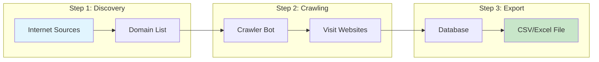
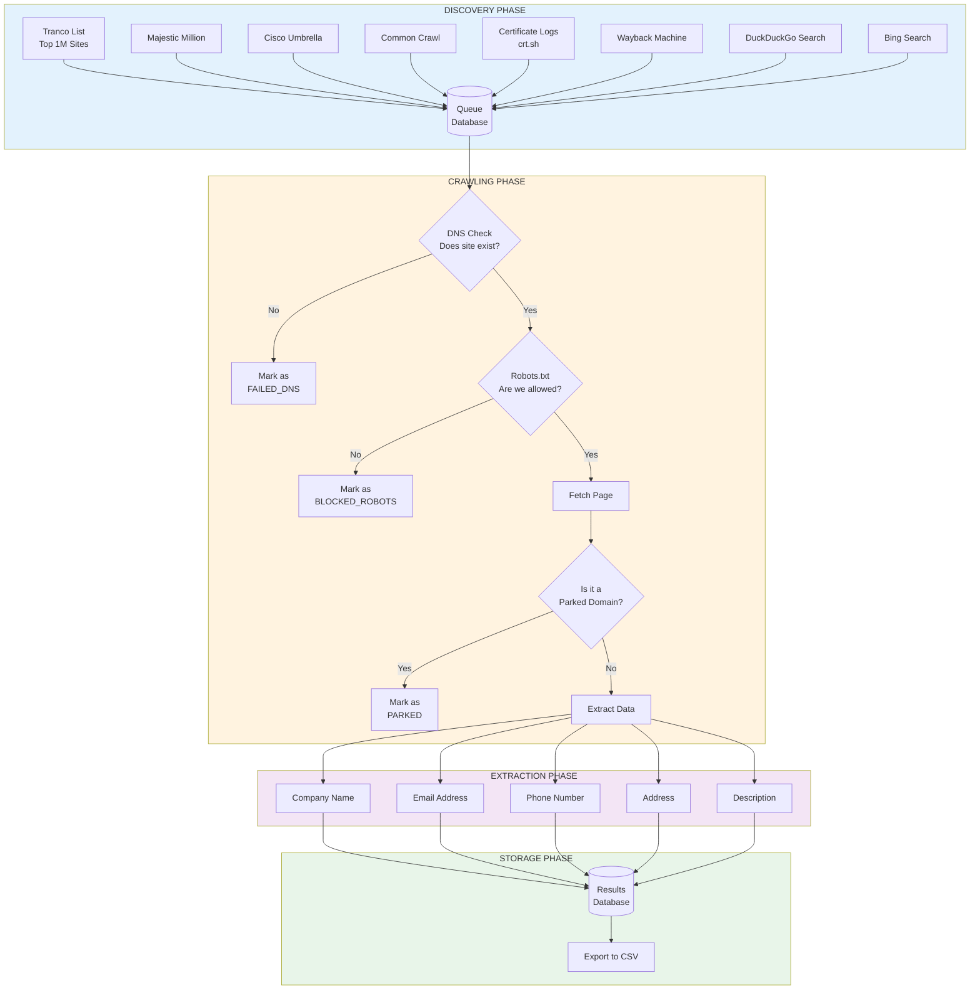
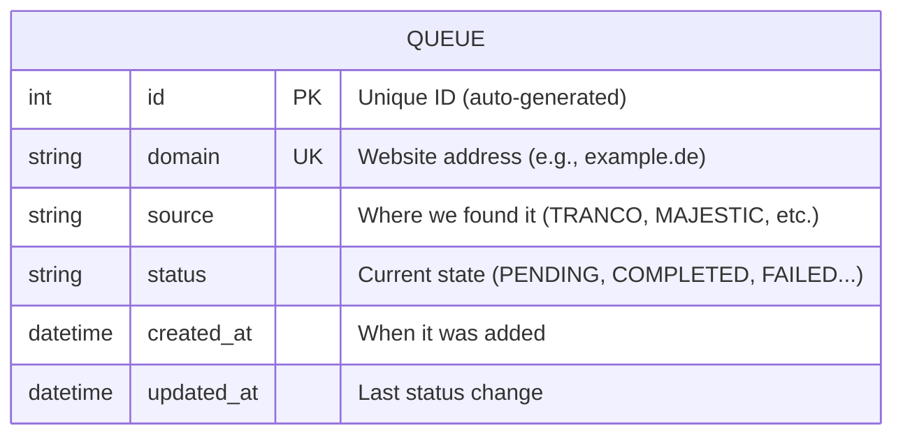
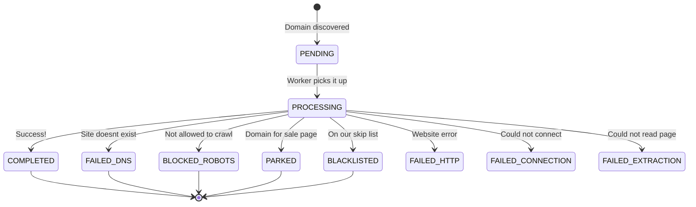
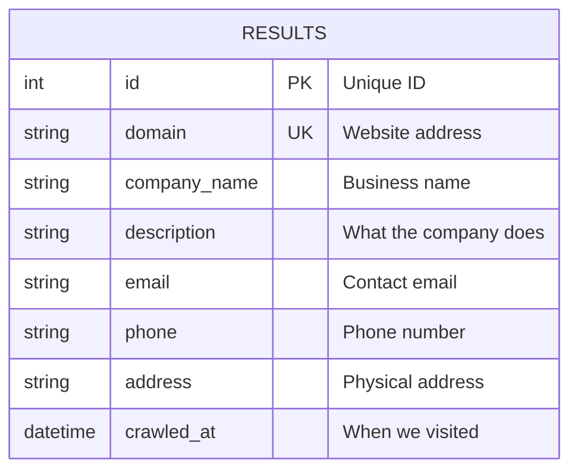
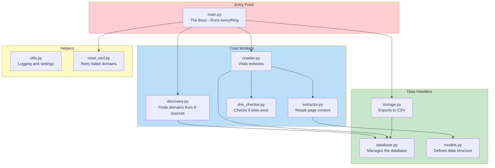
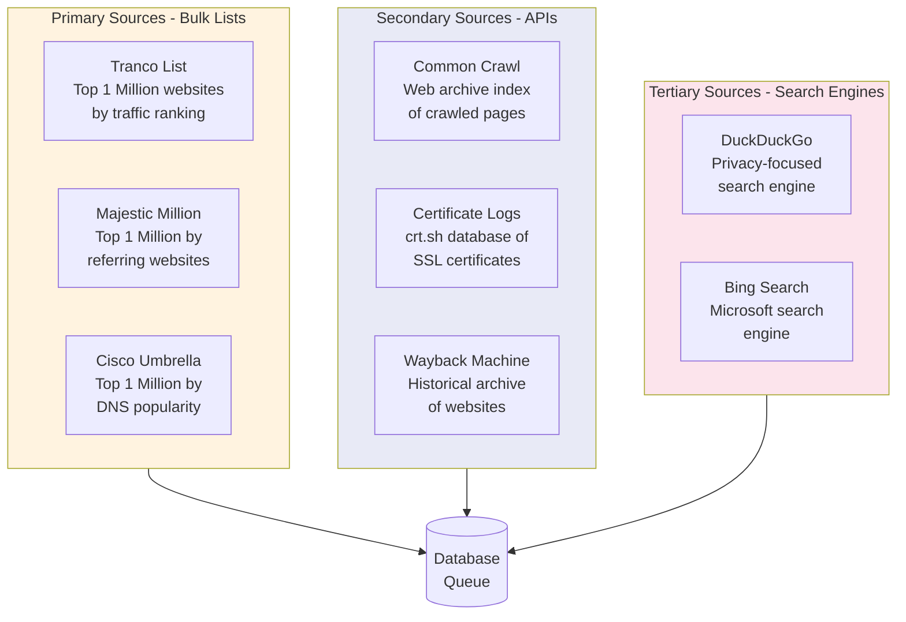
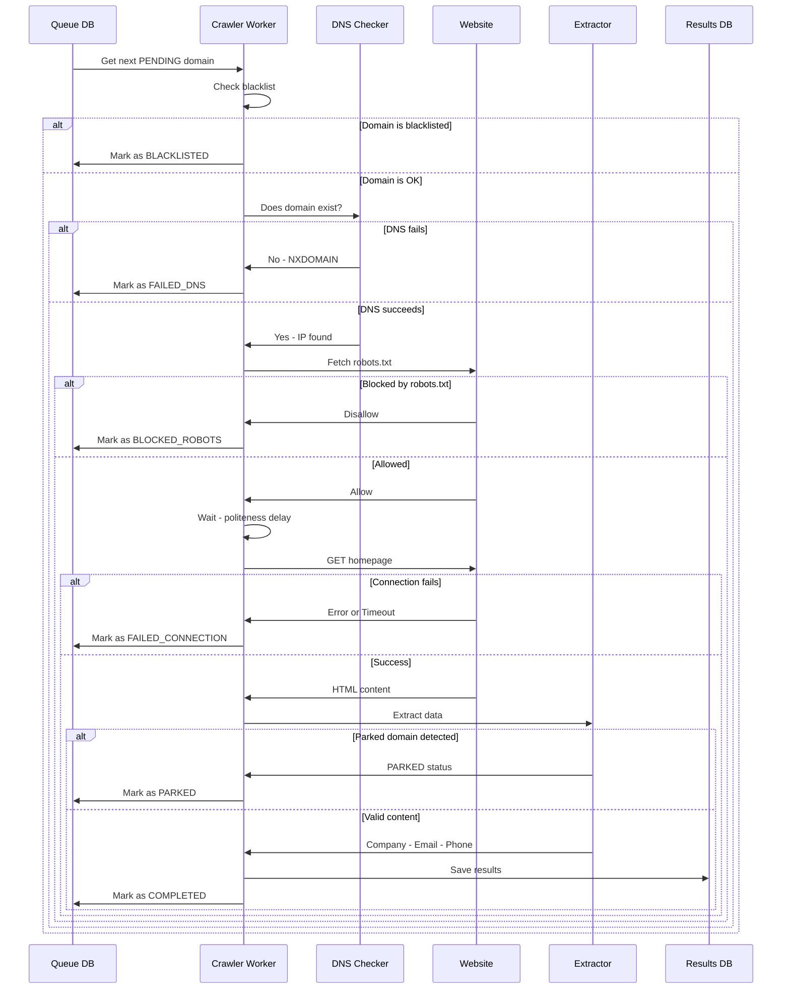
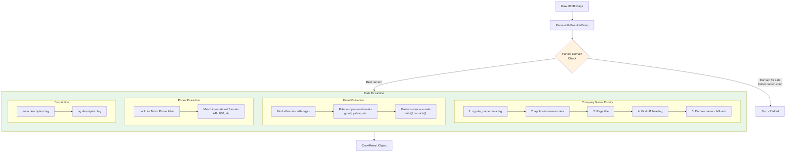

# Data Model & Architecture Guide

> **For Non-Technical Users:** This document explains how the Web Crawler works "under the hood" using simple diagrams and explanations. Think of it as a map of the system!

---

## Table of Contents

1. [Overview - The Big Picture](#overview---the-big-picture)
2. [How Data Flows Through the System](#how-data-flows-through-the-system)
3. [Database Tables Explained](#database-tables-explained)
4. [Source Files & What They Do](#source-files--what-they-do)
5. [Domain Discovery Sources](#domain-discovery-sources)
6. [The Crawling Process](#the-crawling-process)
7. [Data Extraction](#data-extraction)

---

## Overview - The Big Picture

The Web Crawler is like a robot assistant that:
1. **Finds** websites (Discovery)
2. **Visits** those websites (Crawling)
3. **Collects** business information (Extraction)
4. **Saves** everything to a file you can open in Excel (Export)



---

## How Data Flows Through the System

This diagram shows the complete journey of data from start to finish:



---

## Database Tables Explained

The crawler stores everything in a **SQLite database** (a simple file-based database). There are two main "tables" (like spreadsheets):

### Table 1: Queue (The To-Do List)

This table keeps track of all domains we need to visit.



| Column | What It Means | Example |
|--------|---------------|---------|
| `id` | Unique number for each entry | 1, 2, 3... |
| `domain` | The website address | `example.de` |
| `source` | Where we found this domain | `TRANCO`, `MAJESTIC`, `CRTSH` |
| `status` | What's happening with it | See status list below |
| `created_at` | When we added it | `2024-01-15 10:30:00` |
| `updated_at` | Last time we touched it | `2024-01-15 11:45:00` |

#### Possible Status Values



### Table 2: Results (The Collected Data)

This table stores the actual business information we found.



| Column | What It Means | Example |
|--------|---------------|---------|
| `domain` | The website | `acme-corp.de` |
| `company_name` | Business name | `ACME Corporation GmbH` |
| `description` | What they do | `Leading provider of...` |
| `email` | Contact email | `info@acme-corp.de` |
| `phone` | Phone number | `+49 30 123456` |
| `address` | Location | `Musterstrasse 123, Berlin` |

---

## Source Files & What They Do

Think of each file as a worker with a specific job:



### File Details

| File | Purpose | Simple Explanation |
|------|---------|-------------------|
| `main.py` | Entry point | The "start button" - runs the whole show |
| `discovery.py` | Find domains | Searches 8 different sources to find websites |
| `crawler.py` | Visit sites | The robot that opens each website |
| `extractor.py` | Read content | Finds emails, phone numbers, etc. on pages |
| `dns_checker.py` | Check DNS | Makes sure websites actually exist |
| `database.py` | Database ops | Saves and retrieves data |
| `storage.py` | Export data | Creates the final CSV/Excel file |
| `models.py` | Data shapes | Defines what data looks like |
| `utils.py` | Utilities | Logging, colors, settings |
| `reset_tool.py` | Reset tool | Lets you retry failed domains |

---

## Domain Discovery Sources

The crawler searches **8 different sources** to find as many domains as possible:



### Source Comparison

| Source | Type | Typical Yield | Best For |
|--------|------|---------------|----------|
| Tranco | CSV Download | Very High | Popular sites |
| Majestic | CSV Download | Very High | Sites with backlinks |
| Umbrella | CSV Download | High | DNS-popular sites |
| Common Crawl | API | Medium | Recently crawled sites |
| crt.sh | API | High | New domains (SSL certs) |
| Wayback | API | Medium | Historical/older sites |
| DuckDuckGo | Web Scrape | Low-Medium | Fresh results |
| Bing | Web Scrape | Low-Medium | Alternative results |

---

## The Crawling Process

Here's what happens when the crawler visits each website:



---

## Data Extraction

The Extractor looks for specific information on each page:



### Email Filtering Rules

The crawler is smart about which emails to keep:

| Email Type | Example | Action |
|------------|---------|--------|
| Business (same domain) | `info@company.de` | KEEP (priority) |
| Generic business | `contact@company.de` | KEEP |
| Personal (free provider) | `john@gmail.com` | SKIP |
| Personal pattern | `john.smith@company.de` | SKIP (GDPR) |

---

## Project File Structure

```
Web Crawler/
|
|-- main.py              # Start here! The main entry point
|-- requirements.txt     # Python packages needed
|-- README.md            # Quick start guide
|
|-- src/                 # Source code
|   |-- discovery.py     # Finds domains (8 sources)
|   |-- crawler.py       # Visits websites
|   |-- extractor.py     # Extracts data from HTML
|   |-- dns_checker.py   # Verifies domains exist
|   |-- database.py      # Database operations
|   |-- storage.py       # CSV export
|   |-- models.py        # Data structures
|   |-- utils.py         # Helpers (logging, settings)
|   +-- reset_tool.py    # Reset failed domains
|
|-- config/              # Configuration
|   |-- settings.yaml    # Crawler settings
|   +-- blacklist.txt    # Sites to skip
|
|-- data/                # Output data
|   |-- crawler_data.db  # SQLite database
|   |-- top-1m.csv       # Downloaded Tranco list
|   |-- majestic_million.csv  # Downloaded Majestic list
|   +-- results_*.csv    # Exported results
|
|-- logs/                # Log files
|   +-- crawler.log      # Detailed activity log
|
+-- docs/                # Documentation
    +-- DATA_MODEL.md    # This file!
```

---

## Quick Reference Commands

| What You Want | Command |
|---------------|---------|
| Find 500 German domains | `python main.py discover --tld de --limit 500` |
| Find 1000 Swiss domains | `python main.py discover --tld ch --limit 1000` |
| Start crawling | `python main.py crawl --concurrency 10` |
| Export results | `python main.py export --tld de` |
| Reset failed domains | `python main.py reset` |

---

*Document generated for Web Crawler v1.0*
